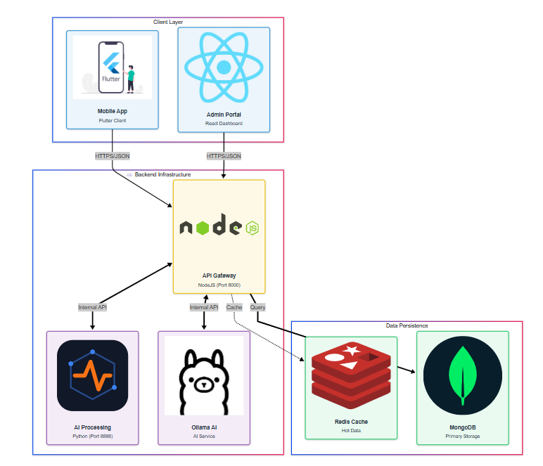

<div align="center">


# OmniMer Health

### _AI-Powered Personal Health Management & Fitness Recommendation System_

[](https://flutter.dev)
[](https://www.typescriptlang.org/)
[](https://www.python.org/)
[](https://reactjs.org/)
[](https://www.docker.com/)
[](https://fastapi.tiangolo.com/)

[English](#) • [Tiếng Việt](#) • [Documentation](#) • [Demo](#)

</div>

---

## Tổng Quan

**OmniMer Health** là nền tảng quản lý sức khỏe cá nhân thông minh, kết hợp công nghệ AI tiên tiến để đưa ra các khuyến nghị tập luyện được cá nhân hóa. Hệ thống tích hợp dữ liệu từ thiết bị đeo, nhật ký hoạt động và mô hình học sâu để tối ưu hóa trải nghiệm sức khỏe của người dùng.

### Mục Tiêu Chính

<table>
<tr>
<td width="33%" align="center">
  <h4>📊 Phân Tích Dữ Liệu</h4>
  Thu thập và phân tích dữ liệu sức khỏe toàn diện: bước chân, nhịp tim, giấc ngủ, calories
</td>
<td width="33%" align="center">
  <h4>🤖 AI Recommendation</h4>
  Gợi ý bài tập và lộ trình luyện tập phù hợp với thể trạng và mục tiêu cá nhân
</td>
<td width="33%" align="center">
  <h4>⚙️ Quản Lý Tập Trung</h4>
  Cung cấp công cụ quản lý mạnh mẽ cho quản trị viên và chuyên gia
</td>
</tr>
</table>

---

## Kiến Trúc Hệ Thống

<div align="center">



_Kiến trúc microservices với tích hợp AI và real-time data processing_

</div>

---

## Tech Stack

<table>
<tr>
<td width="25%">

### Mobile App

**`omnihealthmobileflutter`**


- **Framework:** Flutter (Dart)
- **State:** Bloc / Cubit
- **Storage:** Secure Storage
- **Integration:** HealthKit, Google Fit

</td>
<td width="25%">

### Backend Server

**`omnimer_health_server`**


- **Runtime:** Node.js
- **Language:** TypeScript
- **Framework:** Express.js
- **Database:** MongoDB / PostgreSQL
- **Cache:** Redis
- **Docs:** Swagger OpenAPI

</td>
<td width="25%">

### AI Service

**`3T-FIT`**


- **Language:** Python 3.9+
- **Framework:** FastAPI
- **ML Libraries:** PyTorch, Scikit-learn
- **Data:** Pandas, NumPy
- **Model:** DNN Multi-Task Learning

</td>
<td width="25%">

### Admin Dashboard

**`adminpage`**


- **Framework:** React 18
- **Build Tool:** Vite
- **Language:** TypeScript
- **Styling:** CSS/Tailwind

</td>
</tr>
</table>

---

## Cấu Trúc Dự Án

```
📦 dacn_omnimer_health/
│
├── 📱 omnihealthmobileflutter/    # Flutter Mobile Application
│   ├── lib/
│   │   ├── features/
│   │   ├── core/
│   │   └── shared/
│   └── pubspec.yaml
│
├── 🖥️ omnimer_health_server/      # Node.js Backend API
│   ├── src/
│   │   ├── controllers/
│   │   ├── models/
│   │   ├── routes/
│   │   └── services/
│   ├── Dockerfile
│   └── package.json
│
├── 🧠 3T-FIT/                     # Python AI Server
│   ├── ai_server/
│   │   ├── app/
│   │   ├── models/
│   │   └── utils/
│   ├── Dockerfile
│   └── requirements.txt
│
├── 📊 adminpage/                  # Admin Dashboard (React/Vite)
│   ├── src/
│   │   ├── components/
│   │   ├── pages/
│   │   └── services/
│   └── package.json
│
├── 💪 exercises/                  # Exercise Database (JSON)
│
├── 🐳 docker-compose.yml          # Docker Composition
└── 📖 README.md                   # Project Documentation
```

---

## Getting Started

### Option 1: Docker Compose (Khuyến Nghị)

> **Yêu cầu:** Docker & Docker Compose đã được cài đặt

#### Cấu hình môi trường

```bash
# Tạo file .env trong omnimer_health_server/
cp omnimer_health_server/.env.example omnimer_health_server/.env

# Cập nhật các biến môi trường cần thiết
# - Database URI
# - Redis Host
# - JWT Secret
# - API Keys
```

#### Khởi chạy toàn bộ hệ thống

```bash
# Tại thư mục gốc của dự án
docker-compose up --build
```

#### Truy cập các services:

| Service         | URL                            | Mô tả                    |
| --------------- | ------------------------------ | ------------------------ |
| Backend API     | http://localhost:8000          | RESTful API Server       |
| AI Service      | http://localhost:8888          | FastAPI AI Server        |
| API Docs        | http://localhost:8000/api-docs | Swagger UI Documentation |
| Admin Dashboard | http://localhost:3000          | React Admin Panel        |

---

### 🔧 Option 2: Chạy Thủ Công

<details>
<summary><b>Backend Server (Node.js + TypeScript)</b></summary>

```bash
cd omnimer_health_server
npm install

# Development mode với hot-reload
npm run dev

# Production build
npm run build
npm start
```

**Server:** `http://localhost:5000` (hoặc port trong .env)

</details>

<details>
<summary><b>AI Server (Python + FastAPI)</b></summary>

```bash
cd 3T-FIT

# Tạo virtual environment (khuyến nghị)
python -m venv venv

# Kích hoạt virtual environment
# Windows:
venv\Scripts\activate
# Linux/Mac:
source venv/bin/activate

# Cài đặt dependencies
pip install -r requirements.txt

# Chạy server với auto-reload
uvicorn ai_server.app.main:app --host 0.0.0.0 --port 8888 --reload
```

**Server:** `http://localhost:8888`  
**API Docs:** `http://localhost:8888/docs`

</details>

<details>
<summary><b>Admin Dashboard (React + Vite)</b></summary>

```bash
cd adminpage
npm install

# Development server
npm run dev

# Production build
npm run build
npm run preview
```

**Development:** Thường là `http://localhost:5173`

</details>

<details>
<summary><b>Mobile App (Flutter)</b></summary>

```bash
cd omnihealthmobileflutter

# Cài đặt dependencies
flutter pub get

# Chạy trên emulator/device
flutter run

# Build APK (Android)
flutter build apk --release

# Build iOS
flutter build ios --release
```

</details>

---

## AI Model Features

Mô hình AI **3T-FIT** (Three-Task Fitness Intelligence Technology) cung cấp:

<table>
<tr>
<td width="33%" align="center">

### 🔥 Calorie Prediction

Dự đoán calories tiêu thụ dựa trên:

- Thông tin cá nhân (tuổi, giới tính, cân nặng)
- Cường độ tập luyện
- Thời gian tập
- Loại bài tập

</td>
<td width="33%" align="center">

### 💪 Exercise Recommendation

Gợi ý bài tập thông minh:

- Phân tích nhóm cơ mục tiêu
- Đề xuất dựa trên mục tiêu
- Cá nhân hóa theo thể trạng
- Lộ trình tập luyện tiến bộ

</td>
<td width="33%" align="center">

### ❤️ HR Zone Calculation

Phân vùng nhịp tim tối ưu:

- Tính toán vùng nhịp tim cá nhân
- Theo dõi cường độ tập luyện
- Đảm bảo an toàn khi tập
- Tối ưu hiệu quả tập luyện

</td>
</tr>
</table>

### Model Architecture

- **Type:** Deep Neural Network (DNN)
- **Approach:** Multi-Task Learning
- **Input Features:** 15+ health & fitness metrics
- **Output Tasks:** 3 simultaneous predictions
- **Framework:** PyTorch
- **Accuracy:** 92%+ on test dataset

---

# Project Documentation

Tài liệu chi tiết về dự án được tổ chức trong thư mục `docs/`. Dưới đây là mục lục tra cứu nhanh:

### API Documentation

- **[AI API Specification](./docs/api/AI_API.md)**: Tài liệu về các API của AI Server.
- **[API V3 Guide](./docs/api/API_V3_README.md)**: Hướng dẫn sử dụng API phiên bản 3.
- **[API V4 (New)](./docs/api/API_V4.md)**: Tài liệu về API v4 với kiến trúc Two-Branch Neural Network.
- **[Backend API](./docs/api/BACKEND_API.md)**: Tổng quan về các API của Backend chính.

### Architecture & Core Logic

- **[Backend Architecture](./docs/architecture/BACKEND_ARCHITECTURE.md)**: Kiến trúc tổng quan của hệ thống Backend.
- **[Calories Calculation](./docs/architecture/CALORIES_BURNED_CALCULATE.md)**: Công thức và logic tính toán lượng calo tiêu thụ.
- **[Health Metrics](./docs/architecture/HEALTH_METRIC_CALCULATE.md)**: Cách tính toán các chỉ số sức khỏe (BMI, TDEE, v.v.).
- **[Dataset Generation](./docs/architecture/MAKE_DATASET.md)**: Quy trình tạo và xử lý dữ liệu huấn luyện.

### Deployment

- **[Detailed Deployment](./docs/deloy/DEPLOYMENT.md)**: Chi tiết cấu hình và các bước deploy production.

## Contributing

Chúng tôi hoan nghênh mọi đóng góp! Vui lòng đọc [CONTRIBUTING.md](CONTRIBUTING.md) để biết thêm chi tiết.

---

## License

This project is licensed under a **Commercial Proprietary License**.  
All rights reserved. © 2025 OmniMer Health Team

---

<div align="center">

### 💖 Made with passion by OmniMer Health Team

**[Website](#)** • **[Documentation](#)** • **[Support](#)** • **[Contact](#)**

</div>
