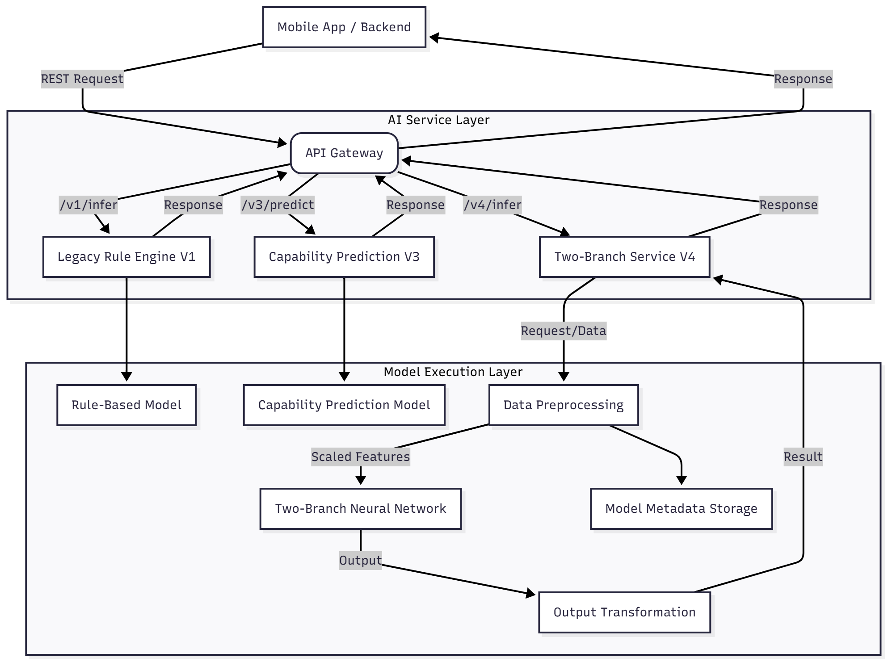

# AI Backend Architecture (3T-FIT)

Hệ thống AI Server (`3T-FIT`) được thiết kế theo kiến trúc **Microservice** sử dụng **FastAPI**, tập trung vào hiệu năng cao và khả năng mở rộng để phục vụ các tác vụ tính toán nặng (Machine Learning Inference).

## 1. Tổng Quan Kiến Trúc



---

## 2. Các Thành Phần Chính

### 2.1. API Layer (`app/main.py`)

Điểm tiếp nhận request từ bên ngoài.

- **Framework:** FastAPI (Asynchronous, High Performance).
- **Chức năng:**
  - Routing request đến đúng version service (v1, v3, v4).
  - Validation dữ liệu đầu vào bằng `Pydantic Schemas`.
  - Load balancing và quản lý vòng đời ứng dụng (Startup/Shutdown events).

### 2.2. Service Layer (`app/services`)

Chứa logic nghiệp vụ và xử lý luồng dữ liệu.

- `recommendation_v1.py`: Logic gợi ý cơ bản (Legacy).
- `recommendation_v3.py`: Logic gợi ý nâng cao, có tính toán năng lực (Capability).
- `recommendation_v4.py`: Logic mới nhất, tích hợp **Two-Branch Neural Network**.
  - Chuyển đổi JSON request thành Vector đặc trưng (28 chiều).
  - Gọi Model để dự đoán.
  - Hậu xử lý kết quả (Ranking, Filtering).

### 2.3. Model Layer (`app/models`)

Định nghĩa kiến trúc mạng Nơ-ron và quản lý việc load weights.

- `model_v4_arch.py`: Định nghĩa class `TwoBranchRecommendationModel` (PyTorch).
  - **Branch A:** Dự đoán RPE (Regression).
  - **Branch B:** Dự đoán Suitability (Classification).
- Quản lý Artifacts:
  - `model_weights.pth`: Trọng số đã huấn luyện.
  - `feature_scaler.pkl`: Bộ chuẩn hóa dữ liệu (StandardScaler).
  - `model_metadata.json`: Cấu hình mạng (Input dimensions, Layers).

### 2.4. Data Processing Layer (`app/utils`, `model/src`)

Xử lý dữ liệu thô thành dạng Model có thể hiểu được.

- **Feature Engineering:** Tính toán các chỉ số phái sinh như `resistance_intensity`, `cardio_intensity`, `volume_load`.
- **Normalization:** Chuẩn hóa dữ liệu về khoảng [0, 1] hoặc phân phối chuẩn (Z-score).
- **Mapping:** Chuyển đổi các giá trị định danh (Mood, Gender) sang số học.

---

## 3. Luồng Xử Lý (Request Flow - V4)

1.  **Receive:** API nhận POST request tại `/recommend/v4`.
2.  **Validate:** `Pydantic` kiểm tra tính hợp lệ của JSON (kiểu dữ liệu, range).
3.  **Preprocess:**
    - Service gọi hàm `_prepare_input_vector`.
    - Tính toán các chỉ số `Current State` (Mood, Fatigue).
    - Tạo vector 28 chiều cho từng bài tập candidate.
4.  **Inference:**
    - Đưa Batch Vector vào Model V4.
    - Model chạy Forward Pass qua 2 nhánh.
5.  **Post-process:**
    - Lấy kết quả `suitability_score` và `predicted_rpe`.
    - Lọc bỏ các bài có điểm thấp (< 0.4).
    - Sắp xếp danh sách theo điểm giảm dần.
6.  **Response:** Trả về JSON danh sách bài tập đã được xếp hạng.

---

## 4. Công Nghệ Sử Dụng

| Thành phần          | Công nghệ            | Lý do chọn                                                          |
| :------------------ | :------------------- | :------------------------------------------------------------------ |
| **Web Framework**   | **FastAPI**          | Nhanh nhất cho Python, hỗ trợ Async, tự động sinh Docs.             |
| **ML Core**         | **PyTorch**          | Linh hoạt, Dynamic Graph, dễ dàng tùy biến kiến trúc mạng phức tạp. |
| **Data Processing** | **Pandas / NumPy**   | Tiêu chuẩn công nghiệp cho xử lý dữ liệu ma trận.                   |
| **Validation**      | **Pydantic**         | Validation dữ liệu mạnh mẽ, tích hợp sâu với FastAPI.               |
| **Deployment**      | **Docker / Uvicorn** | Dễ dàng đóng gói và triển khai trên mọi môi trường.                 |

## 5. Cấu Trúc Thư Mục (`ai_server/app`)

```
app/
├── api/                # API Schemas & Routes definition
│   ├── schemas.py      # V1/V3 Schemas
│   └── schemas_v4.py   # V4 Schemas (New)
├── models/             # Neural Network Architectures
│   ├── model_v3.py
│   └── model_v4_arch.py # Two-Branch Architecture
├── services/           # Business Logic
│   ├── recommendation_v1.py
│   ├── recommendation_v3.py
│   └── recommendation_v4.py # V4 Logic
├── utils/              # Helper functions
└── main.py             # Application Entry Point
```
