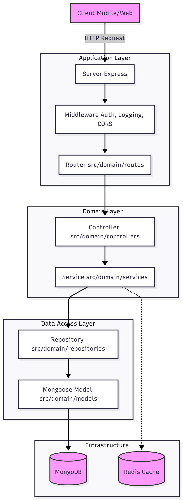

# Architecture Documentation

## 1. Project Overview

**Omnimer Health Server** is a backend application built with **Node.js**, **Express**, and **TypeScript**. It follows a **Layered Architecture** to ensure separation of concerns, scalability, and maintainability. The system uses **MongoDB** as the primary database and **Redis** for caching (specifically for role-based permissions).

## 2. Architecture Diagram

## 3. Request Flow

The data flow follows a standard request-response cycle:

1.  **Request Entry**: The request hits `server.ts` -> `app.ts`.
2.  **Middleware**: Global middleware (CORS, Helmet, Morgan) processes the request.
3.  **Routing**: `src/domain/routes/index.ts` delegates the request to specific feature routes (e.g., `user.route.ts`).
4.  **Controller**: The controller (e.g., `user.controller.ts`) receives the request, validates input, and calls the appropriate Service method.
5.  **Service**: The service (e.g., `user.service.ts`) executes business logic. It may interact with Redis for caching or call the Repository for data access.
6.  **Repository**: The repository (e.g., `user.repository.ts`) abstracts the database operations. It uses the Mongoose Model to query MongoDB.
7.  **Database**: The Mongoose Model (e.g., `user.model.ts`) executes the query against MongoDB.
8.  **Response**: The result bubbles back up: Repository -> Service -> Controller. The Controller formats the response and sends it back to the Client.

## 4. Folder Structure

The project is organized into `src` with the following key directories:

### Root (`src/`)

- **`app.ts`**: Initializes the Express application, middleware, and database connections.
- **`server.ts`**: The entry point that starts the server.

### Common (`src/common/`)

Contains shared resources used across the application.

- **`configs/`**: Configuration files for MongoDB, Redis, Firebase, Swagger, etc.
- **`constants/`**: Constant values and enums.
- **`middlewares/`**: Custom middleware (e.g., error handling, authentication).
- **`types/`**: Global type definitions.
- **`validators/`**: Input validation logic (likely using Zod or similar).

### Domain (`src/domain/`)

Contains the core business logic, organized by technical layers.

- **`controllers/`**: Handles incoming HTTP requests and sends responses.
- **`services/`**: Contains business logic and orchestrates data flow.
- **`repositories/`**: Handles direct data access and database queries.
- **`models/`**: Defines Mongoose schemas and models.
- **`routes/`**: Defines API endpoints and maps them to controllers.
- **`entities/`**: TypeScript interfaces defining the shape of domain objects.

### Other

- **`src/redis/`**: Redis-specific logic (e.g., role permission caching).
- **`src/seeds/`**: Scripts to populate the database with initial data.
- **`src/utils/`**: General utility functions.
