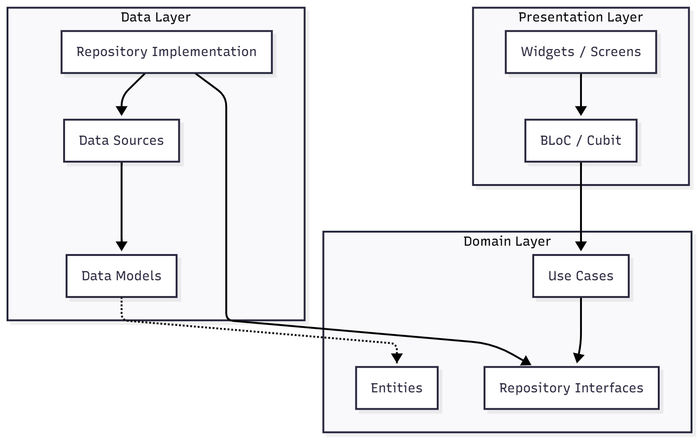

# Kiến Trúc Frontend (Flutter Mobile App)

Dự án `omnihealthmobileflutter` được xây dựng dựa trên kiến trúc **Clean Architecture** kết hợp với **BLoC Pattern** để quản lý state. Kiến trúc này giúp tách biệt rõ ràng giữa các lớp logic, dữ liệu và giao diện, đảm bảo tính dễ bảo trì, mở rộng và testable.

## 1. Tổng Quan Kiến Trúc (Clean Architecture)

Hệ thống được chia thành 3 tầng chính (Layers):

1.  **Presentation Layer (UI & State Management)**
2.  **Domain Layer (Business Logic)**
3.  **Data Layer (Data Access)**



---

## 2. Chi Tiết Các Tầng (Layers)

### 2.1. Presentation Layer (`lib/presentation`)

Chịu trách nhiệm hiển thị giao diện người dùng và xử lý tương tác.

- **Screens (`/screen`)**: Các màn hình của ứng dụng (Login, Home, ExerciseDetail...).
- **Common Widgets (`/common`)**: Các widget tái sử dụng (Button, InputField, Card...).
- **State Management (`/blocs`, `/cubits`)**: Sử dụng thư viện `flutter_bloc`.
  - **BLoC**: Xử lý các luồng sự kiện phức tạp (VD: `AuthenticationBloc`, `ExerciseHomeBloc`).
  - **Cubit**: Quản lý các state đơn giản hơn (VD: `ThemeCubit`, `LoginCubit`).

### 2.2. Domain Layer (`lib/domain`)

Đây là tầng trung tâm, chứa logic nghiệp vụ thuần túy và **không phụ thuộc** vào bất kỳ thư viện bên ngoài nào (như Flutter UI, HTTP client).

- **Entities (`/entities`)**: Các đối tượng dữ liệu cốt lõi (POJO/PODO). Ví dụ: `UserEntity`, `ExerciseEntity`.
- **Use Cases (`/usecases`)**: Đóng gói từng hành động nghiệp vụ cụ thể. Mỗi UseCase chỉ làm một việc duy nhất.
  - Ví dụ: `LoginUseCase`, `GetExercisesUseCase`, `CreateHealthProfileUseCase`.
- **Repository Interfaces (`/abstracts`)**: Định nghĩa các hợp đồng (interface) để truy xuất dữ liệu.
  - Ví dụ: `AuthRepositoryAbs`, `ExerciseRepositoryAbs`.

### 2.3. Data Layer (`lib/data`)

Chịu trách nhiệm lấy và lưu trữ dữ liệu.

- **Models (`/models`)**: Các lớp mô tả cấu trúc dữ liệu từ API hoặc Local DB. Thường kế thừa từ Entity và có thêm các hàm `fromJson`, `toJson`.
- **Data Sources (`/datasources`)**: Nơi thực hiện các cuộc gọi API hoặc truy vấn DB.
  - `RemoteDataSource`: Gọi REST API qua `ApiClient`.
  - `LocalDataSource`: Lưu trữ local (SharedPrefs, SecureStorage).
- **Repositories (`/repositories`)**: Triển khai các interface từ Domain Layer. Quyết định lấy dữ liệu từ nguồn nào (Remote hay Local) và map `Model` sang `Entity`.

---

## 3. Dependency Injection (DI)

Dự án sử dụng `get_it` để quản lý dependencies, được cấu hình trong file `lib/injection_container.dart`.

Quy trình đăng ký (Registration Flow):

1.  **Core & External**: `ApiClient`, `SecureStorageService`.
2.  **Data Sources**: `AuthDataSource`, `ExerciseDataSource`...
3.  **Repositories**: `AuthRepositoryImpl`, `ExerciseRepositoryImpl`...
4.  **Use Cases**: `LoginUseCase`, `GetExercisesUseCase`...
5.  **BLoCs / Cubits**: `AuthenticationBloc`, `ExerciseHomeBloc`...

---

## 4. Luồng Dữ Liệu (Data Flow)

Ví dụ: Quy trình **Đăng nhập (Login)**

1.  **UI**: User nhập username/password và nhấn nút Login.
2.  **Cubit**: `LoginCubit` nhận sự kiện, gọi `LoginUseCase`.
3.  **UseCase**: `LoginUseCase` gọi `AuthRepositoryAbs.login()`.
4.  **Repository**: `AuthRepositoryImpl` gọi `AuthDataSource.login()`.
5.  **DataSource**: `AuthDataSource` gửi HTTP POST request đến API Server.
6.  **Response**:
    - API trả về JSON token.
    - `DataSource` parse JSON thành `AuthModel`.
    - `Repository` map `AuthModel` sang `AuthEntity` và lưu token vào `SecureStorage`.
    - `UseCase` trả về `AuthEntity` (hoặc lỗi) cho `Cubit`.
7.  **UI Update**: `LoginCubit` emit state `LoginSuccess`. UI chuyển hướng sang màn hình Home.

---

## 5. Thư Viện & Công Nghệ Chính

| Hạng mục                 | Thư viện                 | Mục đích                                         |
| :----------------------- | :----------------------- | :----------------------------------------------- |
| **State Management**     | `flutter_bloc`           | Quản lý trạng thái ứng dụng theo mô hình BLoC.   |
| **Dependency Injection** | `get_it`                 | Service Locator pattern để tiêm phụ thuộc.       |
| **Networking**           | `dio`                    | HTTP Client mạnh mẽ để gọi API.                  |
| **Routing**              | `go_router`              | Quản lý điều hướng và Deep linking.              |
| **Local Storage**        | `flutter_secure_storage` | Lưu trữ dữ liệu nhạy cảm (Token).                |
| **UI Utilities**         | `flutter_screenutil`     | Responsive design cho nhiều kích thước màn hình. |
| **Assets Gen**           | `flutter_gen`            | Tự động sinh code cho assets (images, fonts).    |

## 6. Cấu Trúc Thư Mục

```
lib/
├── core/                   # Các thành phần cốt lõi dùng chung
│   ├── api/                # Cấu hình API Client, Interceptors
│   ├── constants/          # Hằng số (API endpoints, keys)
│   ├── theme/              # Cấu hình màu sắc, font chữ
│   └── utils/              # Các hàm tiện ích bổ trợ
├── data/                   # Data Layer
│   ├── datasources/        # Remote & Local Data Sources
│   ├── models/             # Data Models (fromJson/toJson)
│   └── repositories/       # Repository Implementations
├── domain/                 # Domain Layer
│   ├── abstracts/          # Repository Interfaces
│   ├── entities/           # Business Objects
│   └── usecases/           # Business Logic Units
├── presentation/           # Presentation Layer
│   ├── common/             # Shared Widgets
│   └── screen/             # Application Screens
├── services/               # External Services (Storage, Logger)
├── injection_container.dart # DI Setup
└── main.dart               # App Entry Point
```
